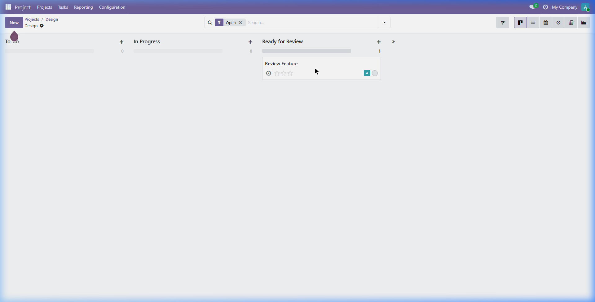
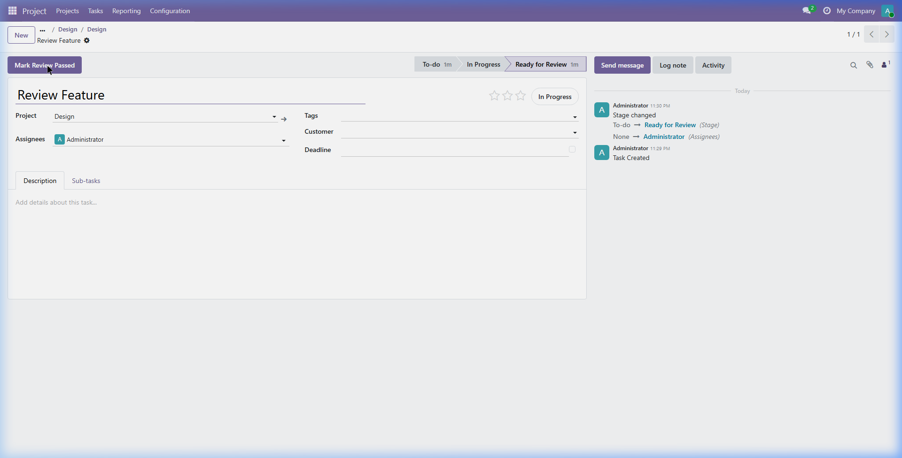

# project_task_quality_review

An Odoo 19 module that adds a Quality Review workflow to project tasks.

## Features
- Adds a **Quality Inspector** field to `project.project`
- Task flow: To-do → In Progress → **Ready for Review** → Done
- Auto-assigns the project's Quality Inspector when a task enters *Ready for Review*
- Inspector clicks **Mark Review Passed** to approve (`is_done = True`, logs timestamp)
- Transition to *Done* is blocked server-side unless `is_done = True`

## Requirements
- Docker & Docker Compose
- Odoo 19 (`odoo:19.0` official Docker image)
- PostgreSQL 14+

## Quick Start

### 1. Clone the repo into your Odoo addons folder
```bash
git clone https://github.com/NgKhai/project_task_quality_review.git
```

### 2. Start Odoo with Docker
```bash
# From the directory containing docker-compose.yml:
docker compose up -d
```
Open http://localhost:8069 and create a database with demo data.

### 3. Install the module
Navigate to **Apps → Update Apps List**, search for **Project Task Quality Review**, and click **Install**.

Or via CLI:
```bash
docker compose exec odoo odoo -d <your_db> -u project_task_quality_review --stop-after-init
```

### 4. Configure
1. Open a project → **Edit** → set **Quality Inspector**.
2. Ensure your project has stages named exactly: `To-do`, `In Progress`, `Ready for Review`, `Done`.

## Usage
1. Create a task and move it to **Ready for Review** — the inspector is auto-assigned.

2. Inspector opens the task and clicks **Mark Review Passed**.

3. Task can now be moved to **Done**.

## Running Tests
```bash
docker compose exec odoo odoo -d <your_db> --test-enable -u project_task_quality_review --stop-after-init
```
